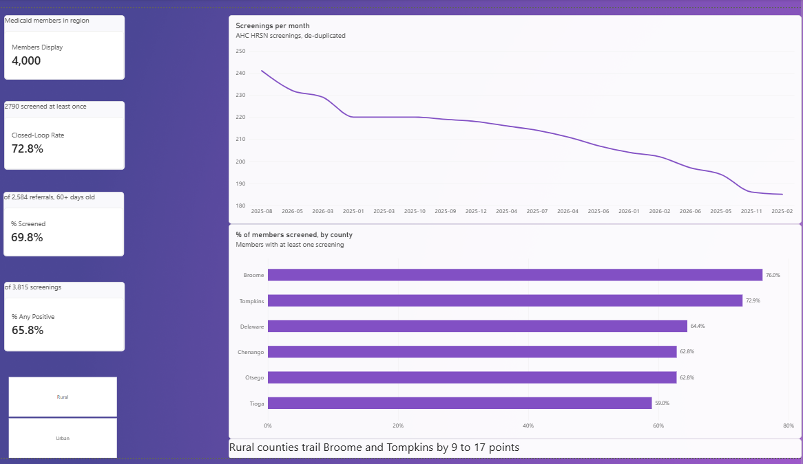
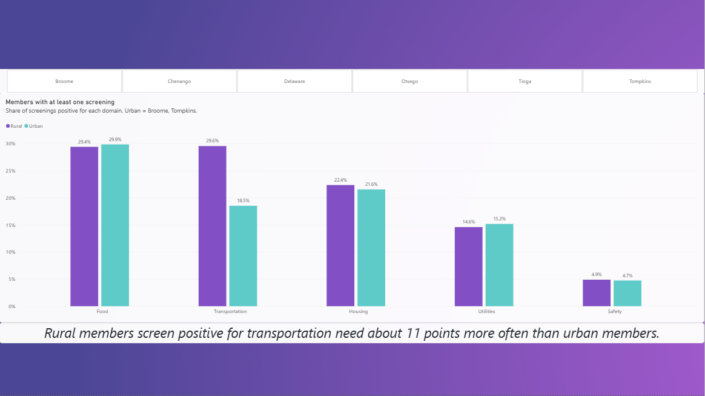
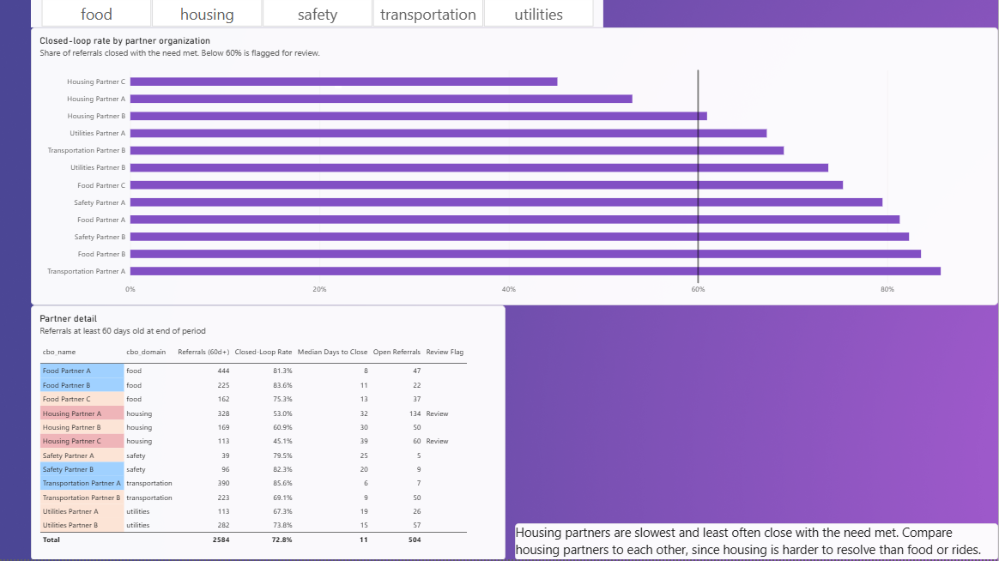

# Social Care Network Performance Analysis (SQL)

SQL analysis of a synthetic Social Care Network (SCN) dataset: screening reach, social need prevalence, closed-loop referral performance by community-based organization (CBO), monthly trends, and ED utilization around referrals.

**All data is synthetic.** It is generated by `generate_data.py` and does not describe any real person or organization. The structure is modeled on New York's Social Care Network program, where Medicaid members are screened for health-related social needs (HRSN) with the Accountable Health Communities (AHC) screening tool and navigated to CBOs for services like food, housing, and transportation. The six counties are the Southern Tier SCN region.

## What's in here

| File | What it does |
|---|---|
| `generate_data.py` | Builds the synthetic dataset (CSVs in `data/`) and loads it into SQLite (`scn.db`) |
| `sql/00_schema.sql` | Table definitions |
| `sql/01_data_quality.sql` | Data-quality checks, plus cleaned views every other query uses |
| `sql/02_screening_reach.sql` | Share of members screened, by county |
| `sql/03_need_prevalence.sql` | Positive-screen rate by need domain, urban vs. rural |
| `sql/04_cbo_closed_loop.sql` | Closed-loop rate and median days to close, by CBO |
| `sql/05_monthly_trend.sql` | Monthly screening volume, month-over-month change, 3-month rolling average |
| `sql/06_ed_use_before_after.sql` | ED visits 180 days before vs. after a met referral |
| `run_queries.py` | Runs every query and writes results to `results/` |
| `results/` | Output of each query, as Markdown tables |
| `export_for_powerbi.py` | Exports cleaned tables as CSVs for the Power BI dashboard (`powerbi/`) |
| `powerbi/` | Power BI report, Dashboard data, DAX measures |

## Run it

Requires Python 3 only (SQLite is built in).

```bash
python generate_data.py
python run_queries.py
```

The queries also run directly in any SQLite client (DB Browser for SQLite). Run `01_data_quality.sql` first, since it creates the cleaned views.

## Dashboard

A three-page Power BI report (Overview, Social Needs, Partner Performance) built on the cleaned tables in `powerbi/`, using a star schema with DAX measures. 




## Data model

```
members ──< screenings ──< referrals >── cbos
   │
   └──< encounters
```

- **members**: county, age group, Medicaid enrollment date
- **screenings**: one row per AHC screening, with a 0/1 flag for each need domain
- **referrals**: one row per referral from a positive screen to a CBO, with status (`open`, `closed_met`, `closed_unmet`) and close date
- **cbos**: organization, county, and the need domain it serves
- **encounters**: ED and inpatient visits

## Findings

**1. Data quality comes first.** The checks found 12 duplicate screenings (double submissions), 7 referrals closed before they were opened, 5 referrals marked closed with no close date, and 4 referrals tied to screenings that don't exist. These were planted in the generator to mimic problems common in partner-submitted data. Every downstream query uses cleaned views (`v_screenings`, `v_referrals`) that remove them, so the metrics aren't inflated or distorted.

**2. Rural counties are under-screened.** Broome (76%) and Tompkins (73%) lead; Tioga (59%), Chenango (63%), and Otsego (63%) trail. That gap points to where outreach capacity or screening partners are thin.

**3. Transportation need is much higher in rural counties.** About 30% of rural screenings are positive for transportation vs. about 19% in Broome and Tompkins. Other domains are roughly equal. Food is the most common need overall (~30%).

**4. Housing referrals are the weak point in the loop.** All three housing CBOs sit at the bottom for closed-loop rate (45% to 61%) and take a month or more to close, compared with 80%+ and about a week for the strongest food and transportation partners. Housing is harder to resolve by nature, so the fair comparison is housing CBO against housing CBO, not against food pantries.

A methods note: the closed-loop rate only counts referrals at least 60 days old. Without that restriction, CBOs get penalized for recent referrals that haven't had time to close, and Housing Partner B falls below the 60% review threshold when it shouldn't.

**5. ED use showed no change before vs. after a met referral** (315 visits per 1,000 members in both windows). Even if it had dropped, this design couldn't show the referral caused it: there's no comparison group, and members often get screened during a high-utilization period that would ease on its own (regression to the mean). A real evaluation would need a matched comparison group.

## SQL techniques used

- CTEs to break multi-step logic into readable pieces
- Window functions: `ROW_NUMBER()` for de-duplication, first-event selection, and a hand-built median; `LAG()` for month-over-month change; windowed `AVG()` for a rolling average
- `LEFT JOIN ... IS NULL` to find orphan records
- Conditional aggregation (`SUM(CASE ...)`, `AVG(CASE ...)`) for side-by-side comparisons
- `UNION ALL` to unpivot wide screening columns into rows
- Date arithmetic with `julianday()` and `date()` modifiers
- Views to keep one cleaned source of truth

## Limitations

The data is simulated with simple probabilities. The synthetic data generator were build with AI assitance(Claude) based on New York's Social Care Network. The numbers are entirely syntethic using Python's random number generator with a fixed starting seed (42).
All data is simulated and does not reflect any real organization. The SQL queries, Power BI, and README are my own work. The point of the project is the method: validate the data, define metrics carefully, and be honest about what a given design can and can't show.
